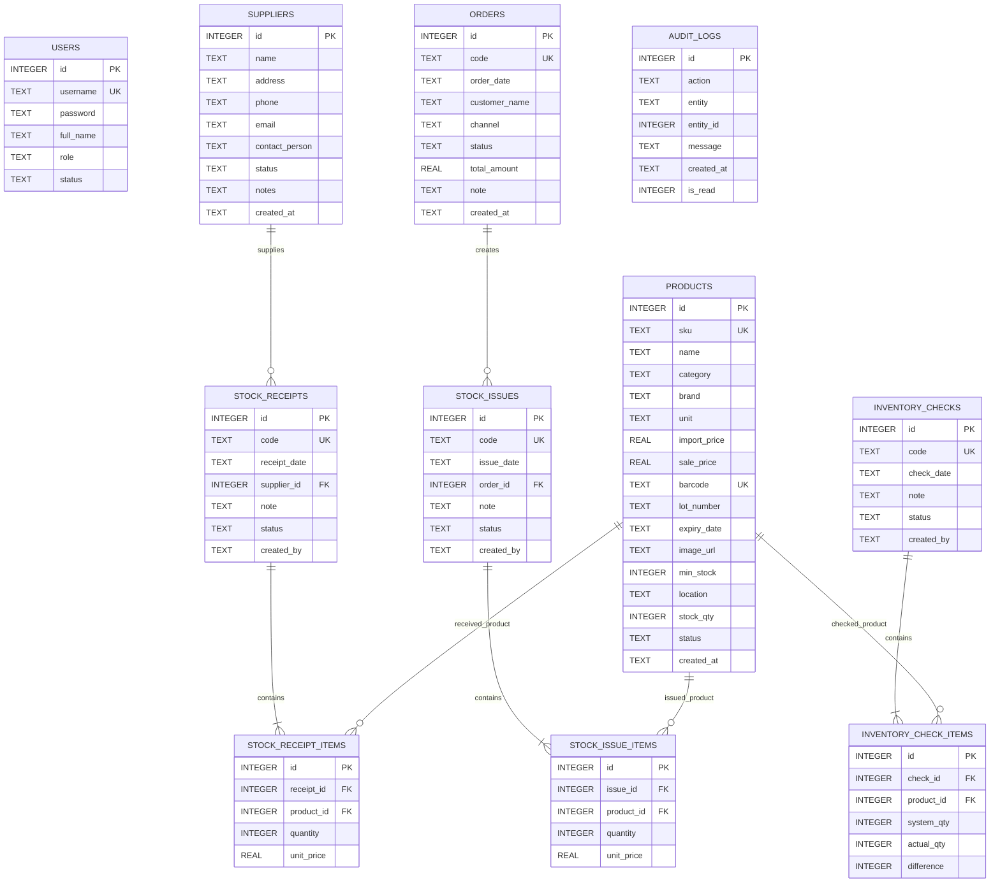
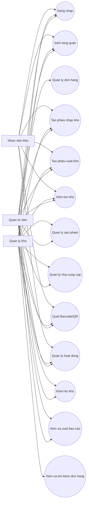
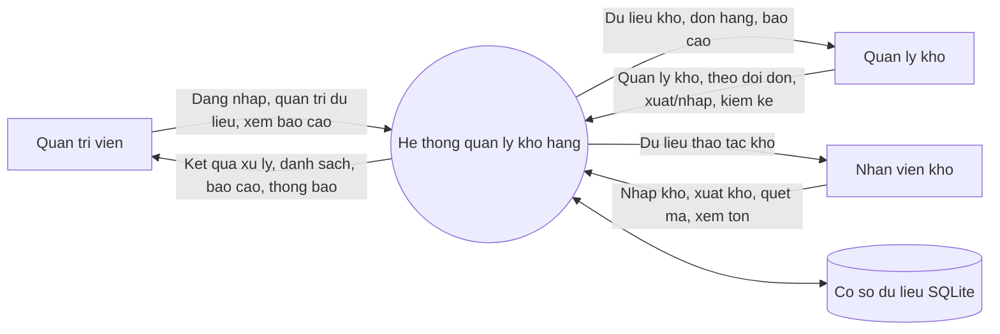
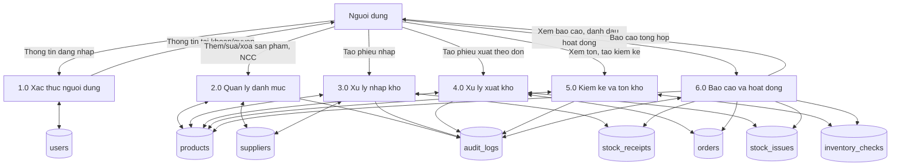
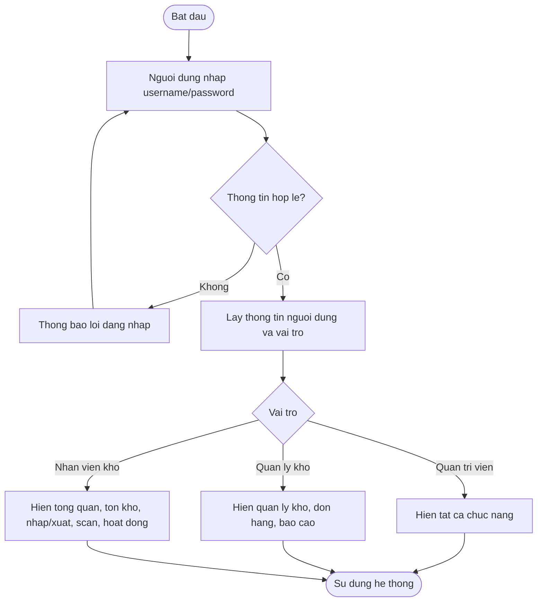
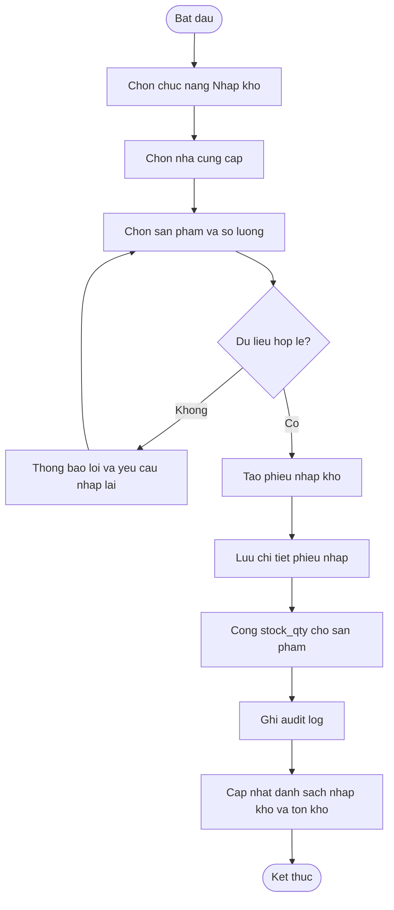
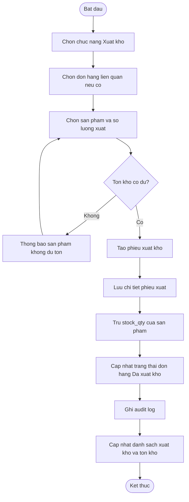
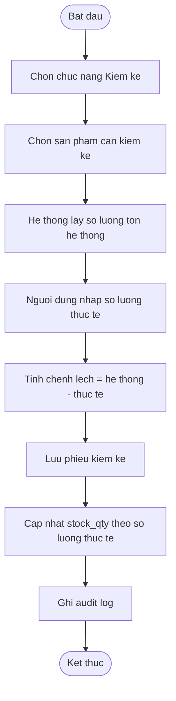
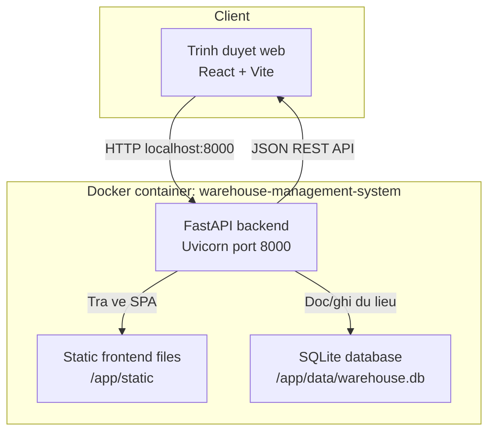
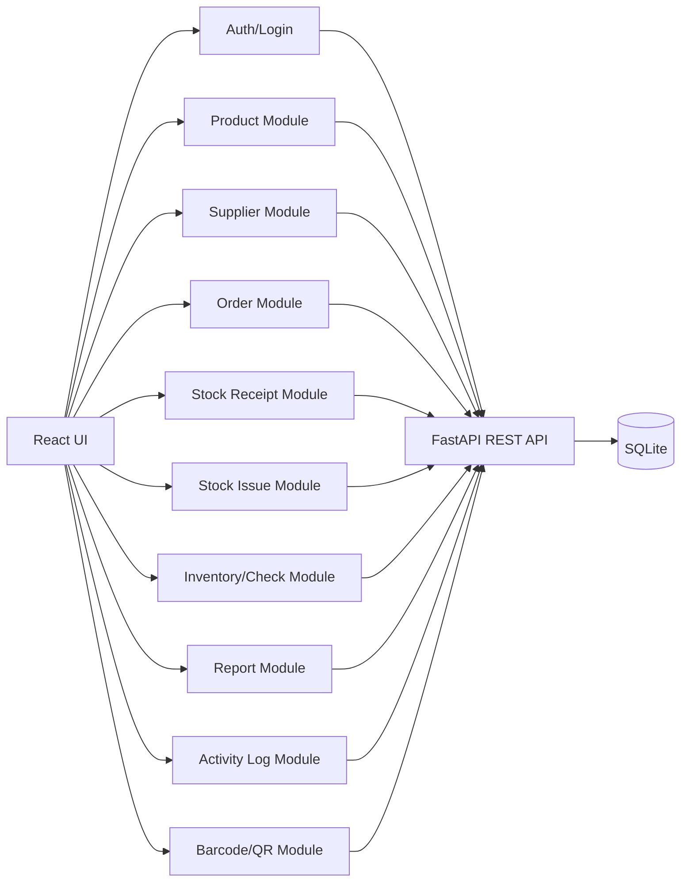

# 3.2.2 Thiet Ke Co So Du Lieu Va 3.2.3 Thiet Ke He Thong

Tai lieu nay mo ta thiet ke du lieu va thiet ke he thong cua ung dung **He thong quan ly kho hang**. Cac so do duoi day su dung cu phap Mermaid, co the dan vao Markdown, Mermaid Live Editor, draw.io hoac cac cong cu ho tro Mermaid de xuat thanh hinh.

## 3.2.2 Thiet Ke Co So Du Lieu

### ERD

Ghi chu: Quan he `STOCK_ISSUES.order_id -> ORDERS.id` dang duoc xu ly theo logic ung dung. Neu trien khai ban san pham that, nen khai bao foreign key truc tiep trong database.

### Data Dictionary

#### users

| Truong | Kieu | Rang buoc | Mo ta |
|---|---|---|---|
| id | INTEGER | PK, AUTOINCREMENT | Ma nguoi dung |
| username | TEXT | UNIQUE, NOT NULL | Ten dang nhap |
| password | TEXT | NOT NULL | Mat khau dang nhap demo |
| full_name | TEXT | NOT NULL | Ho ten hien thi |
| role | TEXT | NOT NULL | Vai tro: Quan tri vien, Quan ly kho, Nhan vien kho |
| status | TEXT | DEFAULT active | Trang thai tai khoan |

#### products

| Truong | Kieu | Rang buoc | Mo ta |
|---|---|---|---|
| id | INTEGER | PK, AUTOINCREMENT | Ma san pham |
| sku | TEXT | UNIQUE, NOT NULL | Ma SKU |
| name | TEXT | NOT NULL | Ten san pham |
| category | TEXT | NOT NULL | Danh muc san pham |
| brand | TEXT | NOT NULL | Thuong hieu |
| unit | TEXT | NOT NULL | Don vi tinh |
| import_price | REAL | DEFAULT 0 | Gia nhap |
| sale_price | REAL | DEFAULT 0 | Gia ban |
| barcode | TEXT | UNIQUE | Ma vach/QR |
| lot_number | TEXT |  | Lo hang |
| expiry_date | TEXT |  | Han su dung |
| image_url | TEXT |  | Duong dan hinh anh |
| min_stock | INTEGER | DEFAULT 10 | Ton kho toi thieu |
| location | TEXT | DEFAULT Kho chinh | Vi tri luu kho |
| stock_qty | INTEGER | DEFAULT 0 | So luong ton hien tai |
| status | TEXT | DEFAULT Dang ban | Trang thai kinh doanh |
| created_at | TEXT | DEFAULT CURRENT_TIMESTAMP | Thoi diem tao |

#### suppliers

| Truong | Kieu | Rang buoc | Mo ta |
|---|---|---|---|
| id | INTEGER | PK, AUTOINCREMENT | Ma nha cung cap |
| name | TEXT | NOT NULL | Ten nha cung cap |
| address | TEXT |  | Dia chi |
| phone | TEXT |  | So dien thoai |
| email | TEXT |  | Email |
| contact_person | TEXT |  | Nguoi lien he |
| status | TEXT | DEFAULT Dang hop tac | Trang thai hop tac |
| notes | TEXT |  | Ghi chu |
| created_at | TEXT | DEFAULT CURRENT_TIMESTAMP | Thoi diem tao |

#### stock_receipts

| Truong | Kieu | Rang buoc | Mo ta |
|---|---|---|---|
| id | INTEGER | PK, AUTOINCREMENT | Ma phieu nhap |
| code | TEXT | UNIQUE, NOT NULL | So phieu nhap |
| receipt_date | TEXT | NOT NULL | Ngay nhap kho |
| supplier_id | INTEGER | FK -> suppliers.id | Nha cung cap |
| note | TEXT |  | Ghi chu |
| status | TEXT | DEFAULT Da xac nhan | Trang thai phieu |
| created_by | TEXT | DEFAULT system | Nguoi tao |

#### stock_receipt_items

| Truong | Kieu | Rang buoc | Mo ta |
|---|---|---|---|
| id | INTEGER | PK, AUTOINCREMENT | Ma dong chi tiet |
| receipt_id | INTEGER | FK -> stock_receipts.id | Phieu nhap |
| product_id | INTEGER | FK -> products.id | San pham nhap |
| quantity | INTEGER | NOT NULL | So luong nhap |
| unit_price | REAL | DEFAULT 0 | Don gia nhap |

#### orders

| Truong | Kieu | Rang buoc | Mo ta |
|---|---|---|---|
| id | INTEGER | PK, AUTOINCREMENT | Ma don hang |
| code | TEXT | UNIQUE, NOT NULL | So don hang |
| order_date | TEXT | NOT NULL | Ngay dat hang |
| customer_name | TEXT | NOT NULL | Ten khach hang |
| channel | TEXT | NOT NULL | Kenh ban hang: Website, Shopee, Lazada, TikTok Shop |
| status | TEXT | NOT NULL | Trang thai don |
| total_amount | REAL | DEFAULT 0 | Tong gia tri don hang |
| note | TEXT |  | Ghi chu |
| created_at | TEXT | DEFAULT CURRENT_TIMESTAMP | Thoi diem tao |

#### stock_issues

| Truong | Kieu | Rang buoc | Mo ta |
|---|---|---|---|
| id | INTEGER | PK, AUTOINCREMENT | Ma phieu xuat |
| code | TEXT | UNIQUE, NOT NULL | So phieu xuat |
| issue_date | TEXT | NOT NULL | Ngay xuat kho |
| order_id | INTEGER | FK logic -> orders.id | Don hang lien quan |
| note | TEXT |  | Ghi chu |
| status | TEXT | DEFAULT Da xac nhan | Trang thai phieu |
| created_by | TEXT | DEFAULT system | Nguoi tao |

#### stock_issue_items

| Truong | Kieu | Rang buoc | Mo ta |
|---|---|---|---|
| id | INTEGER | PK, AUTOINCREMENT | Ma dong chi tiet |
| issue_id | INTEGER | FK -> stock_issues.id | Phieu xuat |
| product_id | INTEGER | FK -> products.id | San pham xuat |
| quantity | INTEGER | NOT NULL | So luong xuat |
| unit_price | REAL | DEFAULT 0 | Don gia xuat |

#### inventory_checks

| Truong | Kieu | Rang buoc | Mo ta |
|---|---|---|---|
| id | INTEGER | PK, AUTOINCREMENT | Ma phieu kiem ke |
| code | TEXT | UNIQUE, NOT NULL | So phieu kiem ke |
| check_date | TEXT | NOT NULL | Ngay kiem ke |
| note | TEXT |  | Ghi chu |
| status | TEXT | DEFAULT Da xac nhan | Trang thai phieu |
| created_by | TEXT | DEFAULT system | Nguoi tao |

#### inventory_check_items

| Truong | Kieu | Rang buoc | Mo ta |
|---|---|---|---|
| id | INTEGER | PK, AUTOINCREMENT | Ma dong chi tiet |
| check_id | INTEGER | FK -> inventory_checks.id | Phieu kiem ke |
| product_id | INTEGER | FK -> products.id | San pham kiem ke |
| system_qty | INTEGER | NOT NULL | Ton kho tren he thong |
| actual_qty | INTEGER | NOT NULL | Ton kho thuc te |
| difference | INTEGER | NOT NULL | Chenh lech ton kho, tinh bang system_qty - actual_qty |

#### audit_logs

| Truong | Kieu | Rang buoc | Mo ta |
|---|---|---|---|
| id | INTEGER | PK, AUTOINCREMENT | Ma nhat ky |
| action | TEXT | NOT NULL | Hanh dong thuc hien |
| entity | TEXT | NOT NULL | Doi tuong bi tac dong |
| entity_id | INTEGER |  | Ma doi tuong |
| message | TEXT | NOT NULL | Noi dung hoat dong |
| created_at | TEXT | DEFAULT CURRENT_TIMESTAMP | Thoi gian ghi nhan |
| is_read | INTEGER | DEFAULT 0 | Trang thai da doc/chua doc |

## 3.2.3 Thiet Ke He Thong

### Use Case Diagram

### DFD Muc 0 - Context Diagram

### DFD Muc 1

### Activity Diagram - Dang Nhap Va Dieu Huong Theo Quyen

### Activity Diagram - Quy Trinh Nhap Kho

### Activity Diagram - Quy Trinh Xuat Kho

### Activity Diagram - Quy Trinh Kiem Ke

### Kien Truc He Thong

### Component Diagram

### Ma Tran Phan Quyen

| Chuc nang | Quan tri vien | Quan ly kho | Nhan vien kho |
|---|---|---|---|
| Tong quan | Xem | Xem | Xem |
| San pham | Xem, them, sua, ngung kinh doanh | Xem, them, sua, ngung kinh doanh | Khong xem |
| Nha cung cap | Xem, them, sua, ngung hop tac | Xem, them, sua, ngung hop tac | Khong xem |
| Don hang | Xem, tim kiem, them, sua, xoa | Xem, tim kiem | Khong xem |
| Nhap kho | Xem, tim kiem, tao phieu | Xem, tim kiem, tao phieu | Xem, tim kiem, tao phieu |
| Xuat kho | Xem, tim kiem, tao phieu | Xem, tim kiem, tao phieu | Xem, tim kiem, tao phieu |
| Ton kho | Xem | Xem | Xem |
| Kiem ke | Xem, tao kiem ke | Xem, tao kiem ke | Khong xem |
| Bao cao | Xem, xuat bao cao | Xem, xuat bao cao | Khong xem |
| Barcode/QR | Quet/tim san pham | Quet/tim san pham | Quet/tim san pham |
| Hoat dong | Xem, danh dau doc, xoa lich su | Xem, danh dau doc | Xem, danh dau doc |
